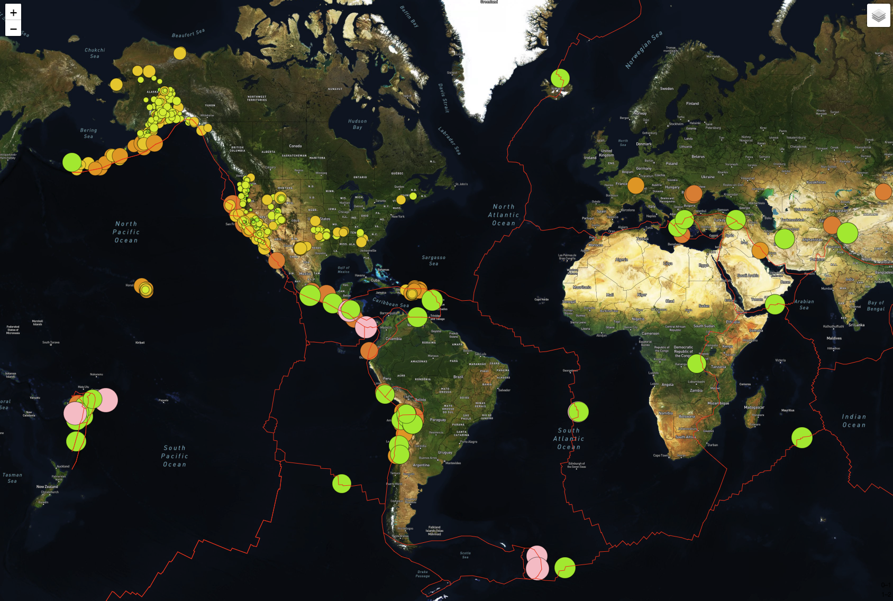
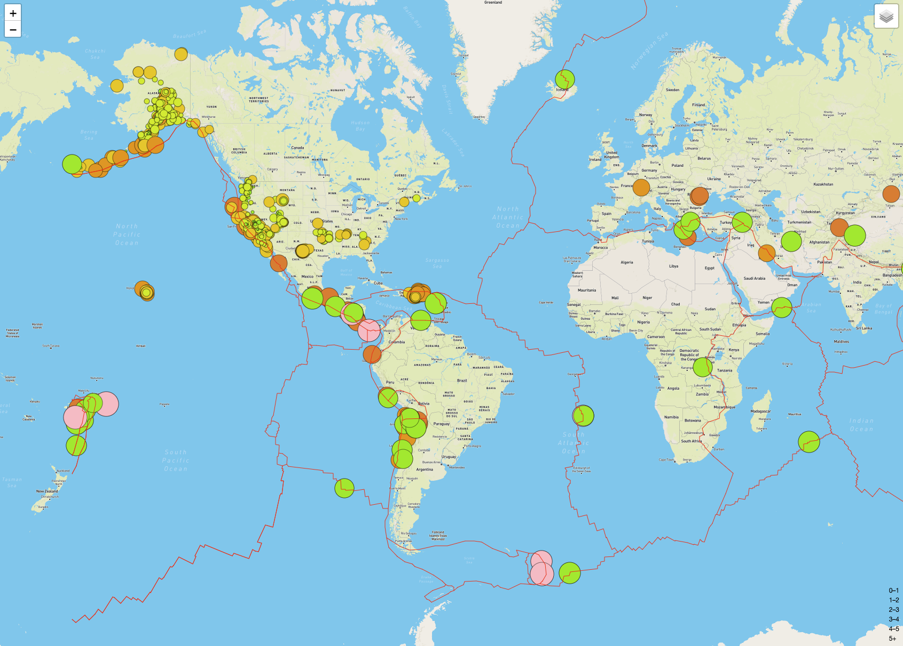
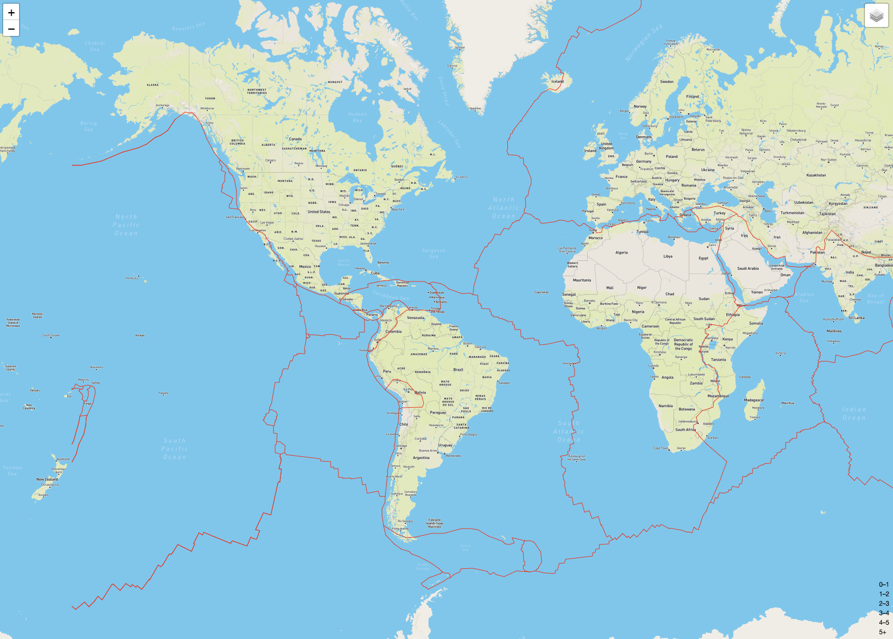

# Mapping_earthquakes

## Overview

The objective of this project is to show the magnitudes of earthquakes all over the world for the last seven days. Display the earthquake data in relation to the tectonic plates’ location on the earth, and to display all the earthquakes with a magnitude greater than 4.5 on the map, and also add a third map.

## Satellite view

## Street view

## Tectonic plate data

